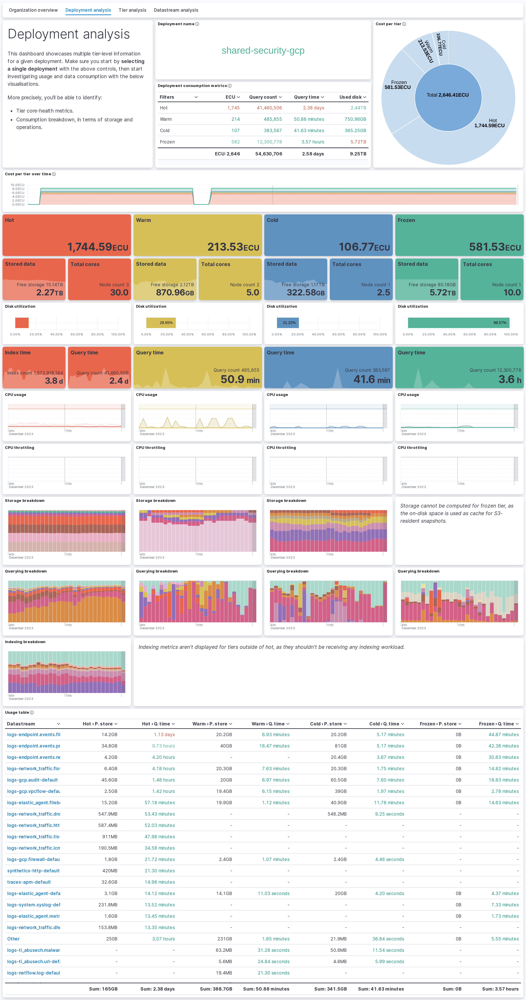
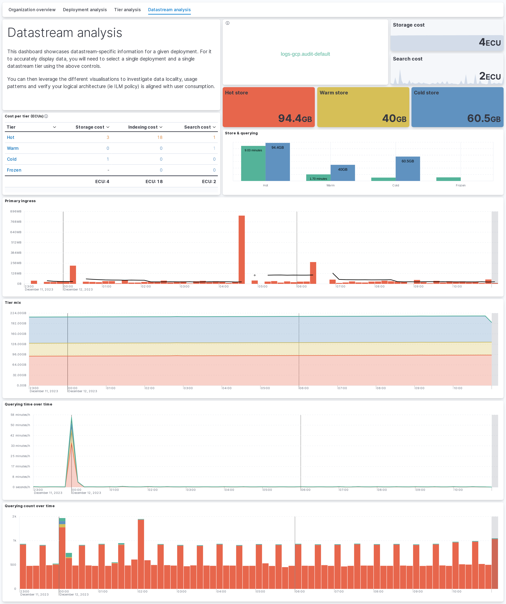
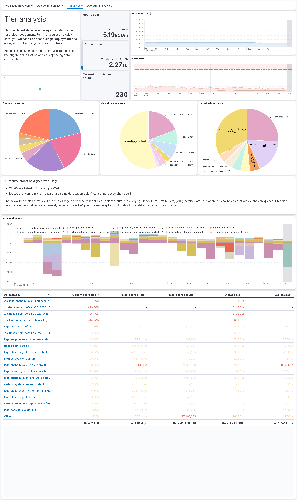
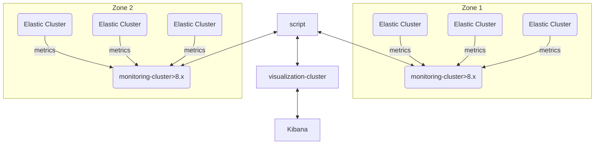

# Ferramentas do Consumption Framework

Este repositório contém diversas ferramentas que auxiliam usuários do Elasticsearch a entenderem melhor os padrões de consumo de seus deployments. O objetivo não é apenas reduzir custos / otimizar despesas, mas também ajudar os usuários a compreender a alocação de recursos e a planejar melhor o crescimento.

Graças aos dados que essas ferramentas conseguem coletar e aos dashboards do Kibana através dos quais eles podem ser visualizados, os usuários podem:

- Entender padrões de ingestão e alocação de custos para toda a sua organização.
- Explorar dados de billing de formas que não são oferecidas nativamente pela interface do Elastic Cloud.
- Compreender quanto dado está sendo indexado e como o armazenamento está sendo utilizado.

## Capturas de tela

<details>

<summary>Clique para expandir</summary>








</details>

## Requisitos

- **Elastic** em produção `> 8.0` ou `9.x` (o framework agora suporta ambas as versões)
- **Python** `>= 3.10`
- **Docker** (opcional, para execução containerizada)
- Código-fonte de referência: <https://github.com/krol3/consumption>

### Compatibilidade de versões do Elasticsearch

O cliente `elasticsearch-py` precisa estar alinhado com a versão do servidor:

| Versão do cluster Elastic | Linha a manter no `requirements.txt`        |
| ------------------------- | ------------------------------------------- |
| 8.x                       | `elasticsearch>=8.3.3,<9`                   |
| 9.x                       | `elasticsearch>=9.0.0,<10` (padrão atual)   |

Por padrão, o `requirements.txt` deste projeto vem configurado para **Elastic 9.x**. Se o seu cluster ainda estiver na versão 8.x, troque a linha do pacote `elasticsearch` antes de instalar as dependências.

### Instalando o Python no CentOS / RHEL

```bash
sudo yum update -y
sudo yum install -y gcc openssl-devel bzip2-devel libffi-devel
```

Download e build do Python a partir do código-fonte:

```bash
cd /usr/src
sudo wget https://www.python.org/ftp/python/3.10.0/Python-3.10.0.tgz
sudo tar xzf Python-3.10.0.tgz
```

> Em distribuições mais recentes do Ubuntu/Debian, basta usar `apt install python3.10 python3.10-venv`.

## Como usar

O script `main.py` expõe múltiplos comandos:

```bash
Usage: main.py [OPTIONS] COMMAND [ARGS]...

Options:
  --help  Show this message and exit.

Commands:
  consume-monitoring  Consome dados de monitoramento de um cluster existente
  get-billing-data    Recupera dados de billing em nível de organização do ESS
  init                Inicializa o cluster de destino
```

- `init` — cria os index templates, política de ILM e ingest pipelines necessários para o funcionamento dos demais comandos.
- `get-billing-data` — recupera os dados de billing do ESS e indexa no cluster de destino. Isso popula o dashboard "Organization overview".
- `consume-monitoring` — consome os dados de monitoramento de um cluster existente e indexa no cluster de destino. Isso popula todos os demais dashboards e fornece a maior granularidade sobre os dados e seu uso.

## Como funciona

A ingestão acontece da seguinte forma:

1. Os clusters ESS enviam suas métricas para uma [instância centralizada de monitoramento](https://www.elastic.co/guide/en/cloud/current/ec-enable-logging-and-monitoring.html).
2. O script consome os índices nativos `.monitoring*` e envia para um cluster de visualização.



Mais informações sobre o modelo de execução podem ser encontradas [neste deck](https://docs.google.com/presentation/d/1aJutCxUlVtnDaTwz-QwcaWMex133edXl-CmV-KeOXPU/edit#slide=id.g2ac43bd4279_0_0) (link interno da Elastic).

### Dados de billing

O script consulta as [APIs de billing do ESS](https://www.elastic.co/guide/en/cloud/current/Billing_Costs_Analysis.html) e salva os resultados no cluster de destino, em um formato facilmente consumível pelos dashboards do Kibana. Como os dados ficam armazenados do lado do Elastic, é possível voltar tão longe quanto se queira no tempo, e o script só busca os dados que ainda não estão presentes no cluster de destino.

### Dados de monitoramento

O princípio base desse comando é aproveitar os dados de monitoramento já coletados pelos coletores nativos. Os principais desafios são:

1. Os dados são coletados em nível de índice, e portanto precisam ser correlacionados com informações de negócio como tier ou datastream.
2. Os contadores nos quais os dados se baseiam são reiniciados quando há movimentação de shards. É necessário, portanto, comparar pontos de dados entre si para entender a evolução das métricas, em vez de olhar o valor instantâneo do contador.

Para enfrentar esses desafios, o script não olha estritamente para um ponto no tempo, mas sim para a evolução dos dados de monitoramento em janelas de 10 minutos, enriquecendo as informações em nível de índice com o contexto dos nós onde os índices estão hospedados. Como o shard de um índice pode se mover a qualquer momento dentro dessa janela de 10 minutos, é importante ressaltar que os resultados devem ser considerados aproximações.

Uma vez que os dados em nível de índice estão devidamente contextualizados, eles são agregados em nível de datastream + tier, e a informação de billing é distribuída entre os datastreams de acordo com seu uso fracional do tier. Três dimensões são usadas para distribuir a informação de billing:

- **Tamanho de armazenamento.** Um datastream que utiliza 10% do storage de um tier receberá a alocação de 10% do custo total daquele tier.
- **Tempo de query.** Um datastream que utiliza 10% do tempo de query de um tier receberá a alocação de 10% do custo total daquele tier.
- **Tempo de indexação.** Um datastream que utiliza 10% do tempo de indexação de um tier receberá a alocação de 10% do custo total daquele tier.

Embora cada dimensão isolada não represente com precisão o uso completo de negócio de um datastream, a combinação das três dimensões — e principalmente as discrepâncias entre elas — ajuda os usuários a compreender o uso de seus dados.

## FAQ

Consulte [este documento](https://docs.google.com/document/d/1QlAValDdp8B0oFABdeSemeBH3ukPj7agulg68AhXfUM/edit#heading=h.3v16o5fpcokw) (link interno da Elastic) para o FAQ.

## Configuração — Passo a passo

### Passo 1 — Criar o arquivo de configuração

Copie o arquivo de exemplo e preencha com seus valores:

```bash
cp config.yml.sample config.yml
```

Configuração mínima (Elastic Cloud / ESS):

```yaml
organization_name: "My Org"
organization_id: "12345"          # de cloud.elastic.co → Account → Organization ID
billing_api_key: "essu_XXXX"      # requer permissões de billing-admin

monitoring_source:
  cloud_id: 'deployment-name:BASE64STRING'
  api_key: 'SOURCE_API_KEY'
  retry_on_timeout: true
  request_timeout: 60

consumption_destination:
  cloud_id: 'deployment-name:BASE64STRING'
  api_key: 'DESTINATION_API_KEY'
```

### Passo 2 — Onde encontrar os identificadores

- **Organization ID / IDs de usuários:** <https://cloud.elastic.co/account/members>
- **Billing API key:** <https://cloud.elastic.co/account/keys>

### Passo 3 — Provisionar as API keys

#### API KEY — `consumption_destination`

Esta API key é usada para escrever no cluster de destino (consumption). Ela também precisa de permissões para gerenciar templates, ILM e pipelines de ingestão (necessárias para o comando `init`):

```json
POST /_security/api_key
{
  "name": "consumption_framework_destination",
  "role_descriptors": {
    "consumption_framework": {
      "indices": [
        {
          "names": [
            "consumption*"
          ],
          "privileges": [
            "read",
            "view_index_metadata",
            "index",
            "auto_configure"
          ]
        }
      ],
      "cluster": [
        "manage_ingest_pipelines",
        "manage_ilm",
        "manage_index_templates"
      ]
    }
  }
}
```

#### API KEY — `monitoring_source`

No cluster `monitoring_source`, o script lê os índices `.monitoring-es-8*` (ou `.monitoring-es-9*` no Elastic 9). O usuário (ou API key) usado para conectar ao cluster precisa, portanto, ter a permissão `read` correspondente. A chamada abaixo provisiona a API key necessária no cluster `monitoring_source`:

```json
POST /_security/api_key
{
  "name": "consumption_framework_source",
  "role_descriptors": {
    "consumption_framework": {
      "indices": [
        {
          "names": [
            ".monitoring-es-8*"
          ],
          "privileges": [
            "read"
          ]
        }
      ]
    }
  }
}
```

> Para clusters Elastic 9.x, ajuste o pattern para `.monitoring-es-9*` (ou use `.monitoring-es-*` para abranger ambas as versões).

### Passo 4 — Importar os dashboards no Kibana

Na pasta `kibana_exports` do repositório existem arquivos `.ndjson` para o Kibana — são saved objects prontos para upload.

No Kibana, vá em **Stack Management → Saved Objects** e clique em **Import** (canto superior direito, a partir da versão 8.12.1). Em seguida, selecione **Import** novamente, escolha o arquivo `.ndjson` (por exemplo, `8.13.1.ndjson`) do seu sistema de arquivos local e clique em **Done** para fechar o painel.

## Executando

### Usando Python (ambiente virtual)

```bash
python3 -m venv venv
source venv/bin/activate
pip3 install -r requirements.txt
```

> Para remover o ambiente: `deactivate` e em seguida `rm -r ./venv`.

Em seguida, importe os dados iniciais de billing do Elasticsearch Service / Elastic Cloud. O comando `get-billing-data` recupera os dados do ESS e indexa no cluster de destino, populando o dashboard de visão geral da organização:

```bash
python3 main.py get-billing-data --config-file config.yml --lookbehind=24 --force --debug
```

Por fim, faça a primeira coleta dos dados de uso do cluster a partir do Monitoring Cluster:

```bash
python3 main.py consume-monitoring --config-file config.yml --lookbehind=24 --force --debug
```

### Usando Docker

Build e teste rápido da imagem:

```bash
docker build -t elastic_consumption_framework:local .

docker run --rm elastic_consumption_framework:local --help
```

Coleta de billing:

```bash
docker run --rm \
  -v $(pwd)/config.yml:/app/config.yml \
  elastic_consumption_framework:local \
  get-billing-data --config-file /app/config.yml --lookbehind 24 --force --debug
```

Inicialização do cluster de destino:

```bash
docker run --rm \
  -v $(pwd)/config.yml:/app/config.yml \
  elastic_consumption_framework:local \
  init --config-file /app/config.yml --lookbehind 24 --force --debug
```

Conferir o `config.yml` montado dentro do container:

```bash
docker run --rm -v $(pwd)/config.yml:/app/config.yml elastic_consumption_framework:local -- cat /app/config.yml
```

## Arquivo de configuração

O arquivo de configuração é um YAML que contém as informações abaixo:

```yaml
---
# Nome da sua organização — esse valor será populado em todos os documentos resultantes
organization_name: "Change me"

# ID da organização no Elastic Cloud (deployments ESS).
# Comente esta linha para deployments on-premises.
organization_id: "12345"

# API key de billing da sua organização.
# Comente esta linha para deployments on-premises.
billing_api_key: "essu_XXXX"

# De onde os dados de monitoramento serão lidos
monitoring_source:
  hosts: 'https://where-i-want-to-get-the-data:443'
  api_key: 'ZZZZZZZZZZZ'
  retry_on_timeout: true
  request_timeout: 60

# Para onde os dados de consumo (resultado da execução do script) serão enviados.
# Pode ser o mesmo cluster do monitoring_source.
consumption_destination:
  hosts: 'https://where-i-want-the-data-to-be-indexed:443'
  api_key: 'YYYYYYYYYYY'

# Para deployments on-premises, especifique os custos do tier por 1 GB de RAM por hora
# on_prem_costs:
#   hot: 1.0
#   warm: 0.5
#   cold: 0.25
#   frozen: 0.1

# Descomente e ajuste para ler índices diferentes do padrão (por exemplo via cross-cluster search)
# monitoring_index_pattern: '.monitoring-es-8*'

# Descomente e ajuste para clientes Federal usando endpoint não padrão do ESS
# api_host: 'api.elastic-cloud.com'
```

- `organization_id` — ID da sua organização no Elastic Cloud. Precisa coincidir com o reportado no ESS.
- `organization_name` — nome da organização. Pode ser nomeado livremente; útil para agregar múltiplos `organization_id` sob um mesmo nome.
- `billing_api_key` — API key usada para buscar dados de billing no ESS. Requer permissão de billing admin e precisa ser gerada para o `organization_id` correspondente.
- `monitoring_source` e `consumption_destination` (anteriormente `source` e `monitoring`) descrevem os parâmetros nativamente passados a um [cliente `Elasticsearch`](https://elasticsearch-py.readthedocs.io/en/latest/api/elasticsearch.html). A seção `monitoring_source` é usada para ler os dados de monitoramento; a `consumption_destination` é usada para indexar os dados no cluster de destino. Os dois podem apontar para o mesmo cluster, desde que as credenciais tenham permissões adequadas.
- `on_prem_costs` — mapeamento do custo por GB de RAM por hora para cada tier. Usado para calcular o custo de clusters on-prem.
- `monitoring_index_pattern` — pattern usado para buscar dados de monitoramento. Útil quando se usa um pattern customizado ou CCS para consultar dados de monitoramento de múltiplos clusters. O valor padrão é `.monitoring-es-8*` (ajuste para `.monitoring-es-9*` ou `.monitoring-es-*` conforme seu ambiente).
- `api_host` — host da API do ESS, usado para buscar dados de billing. Valor padrão: `api.elastic-cloud.com`.

`organization_id` / `billing_api_key` e `on_prem_costs` são mutuamente exclusivos.

Também é possível passar a configuração inline, com o parâmetro `--config-inline` recebendo um JSON. Parâmetros individuais podem ser sobrescritos via `--config KEY=VALUE` (várias vezes, se necessário).

## HOW-TO

Consulte [este documento](https://docs.google.com/document/d/1kyaO9CELxmrttmmIFQWWxLlgahOEaZU7PXG5jOz9b8g/edit) (link interno da Elastic, mas é permitido compartilhar um PDF externamente) para uma descrição completa do deployment da ferramenta.

## Permissões

No cluster `monitoring_source`, o script lê os índices `.monitoring-es-8*` (ou `.monitoring-es-9*` no Elastic 9). O usuário (ou API key) precisa ter a permissão `read` correspondente. Use a chamada de API descrita no [Passo 3 — `monitoring_source`](#api-key--monitoring_source).

No cluster `consumption_destination`, o script escreve nos índices `consumption-[DATA]`. O usuário precisa das permissões `index` e `auto_configure`. A permissão adicional de `read` no índice é necessária para checagens de backlog, evitando que o script recompute dados já existentes (consulte a ajuda do comando para mais detalhes). Use a chamada descrita no [Passo 3 — `consumption_destination`](#api-key--consumption_destination).

Por fim, se você for usar o comando `init`, será necessário adicionar os privilégios de cluster `manage_ingest_pipelines`, `manage_ilm` e `manage_index_templates`.
Alternativamente, é possível subir manualmente o ingest pipeline, política de ILM e index template do diretório [`consumption/_meta`](consumption/_meta) para o cluster `consumption_destination`.

## Troubleshooting

### `UnsupportedProductError` ou cliente recusa a conexão

A versão do cliente `elasticsearch-py` não está alinhada com o servidor. Veja a [tabela de compatibilidade de versões](#compatibilidade-de-versões-do-elasticsearch) acima e ajuste o `requirements.txt` para a linha apropriada (8.x ou 9.x) antes de reinstalar as dependências.

### `KeyError: 'after_key'` nos logs

Atualize para a versão mais recente do framework — esse era um bug de paginação corrigido para ES 8.17+.

### Sem dados nos dashboards após a execução

1. Execute `python main.py diagnose --config-file config.yml` para verificar a disponibilidade dos dados.
2. Confirme que o `init` foi executado no cluster de destino.
3. Verifique se os índices de monitoramento (`.monitoring-es-7-*`, `.monitoring-es-8-*` ou `.monitoring-es-9-*`) existem no cluster de origem.
4. Re-execute com `--debug` para ver logs detalhados das queries.
5. Verifique as permissões da API key em ambos os clusters.

### O script roda mas produz 0 documentos

- Execute `diagnose` para verificar quais dados de monitoramento estão disponíveis.
- Se existem dados V7 mas não V8/V9, garanta que `monitoring_index_pattern` esteja configurado para `.monitoring*` ou `.monitoring-es-7-*`.
- A API key de origem pode estar sem `read` em `.monitoring-es-*`.
- Re-execute com `--force` se os dados existem mas já foram processados anteriormente.

### Custos aparecem como 0

- Se estiver usando `aws_cost_explorer`: cheque as credenciais AWS e as permissões IAM.
- Se estiver usando `on_prem_costs`: confirme que os valores estão definidos no `config.yml`.
- Re-execute com `--debug` e procure por mensagens de log "AWS Cost Explorer" ou "cost".

### Erros de SSL / certificado

Adicione `verify_certs: false` em `monitoring_source` ou `consumption_destination` no seu config (não recomendado para produção). Como alternativa mais segura, forneça `ca_certs: /path/to/ca.pem`.

### Executando atrás de proxy

Defina as variáveis de ambiente `HTTP_PROXY` / `HTTPS_PROXY` — o framework as detecta automaticamente:

```bash
export HTTPS_PROXY=http://proxy.example.com:8080
python main.py consume-monitoring --config-file config.yml
```

Para Docker:

```bash
docker run --rm \
  -e HTTPS_PROXY=http://proxy.example.com:8080 \
  -v "$(pwd)/config.yml:/config.yml" \
  consumption-framework:latest \
  consume-monitoring --config-file /config.yml
```
